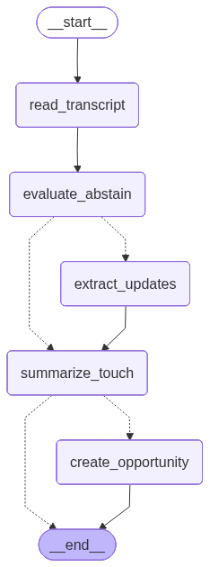

# Tastewise x Luka Cerrutti

<p align="center">
  
  &nbsp;&nbsp;&nbsp;&nbsp;
  
</p>

CLI agent for a Tastewise AI Builder technical challenge. It reads a mock Gong-style sales transcript, decides whether there is enough CRM signal, and either drafts a structured Salesforce opportunity update or abstains while still logging a last-touch summary.

## Run

```bash
uv sync
uv run main.py --help
uv run main.py transcripts/ts-1.txt
uv run main.py transcripts/ts-2.txt
```

Optional abstain threshold:

```bash
uv run main.py transcripts/ts-1.txt --threshold 0.4
```

Sample outputs are available in [`assets/sample-ts-1.md`](assets/sample-ts-1.md) and [`assets/sample-ts-2.md`](assets/sample-ts-2.md).

Environment variables are loaded from `.env`. Required keys are `TOGETHER_API_KEY` plus the LangSmith tracing variables when traceability is enabled.

## Stack

- `Typer`: local CLI with a single transcript path argument and optional `--threshold`.
- `LangGraph`: graph orchestration, branching, and explicit abstain path.
- `LangChain`: model interface and Pydantic structured outputs.
- `Together AI`: hosted model provider for `openai/gpt-oss-120b` and `zai-org/GLM-5.1`.
- `LangSmith`: traces graph execution, agent calls, timings, and run metadata.
- `Pydantic v2`: typed schemas for abstain reasoning, extraction attributes, and final opportunities.

## Files

- `main.py`: CLI, LangGraph workflow, routing, opportunity consolidation, and final JSON output.
- `agents/abstain.py`: signal-quality agent that returns `AbstainEvaluation`.
- `agents/extraction.py`: CRM extraction agent and extraction schemas.
- `agents/summary.py`: last-touch summary agent.
- `logging_utils.py`: stderr progress logging for CLI runs.
- `transcripts/`: sample rich and thin transcripts.

## Video Demo

[Watch the demo video](assets/demo.mp4) showing `ts-1.txt` producing an opportunity JSON and `ts-2.txt` abstaining.

## Visual Graph

<p align="center">
  
</p>

- `read_transcript`: loads the transcript text from disk.
- `evaluate_abstain`: scores transcript value and confidence, then computes `value_index`.
- `extract_updates`: extracts structured CRM updates only when there is enough signal.
- `summarize_touch`: logs a concise last-touch summary for both branches.
- `create_opportunity`: builds the final typed `Opportunity` JSON.

## Agents

- Abstain agent: decides whether the transcript has enough actionable CRM signal.
- Extraction agent: extracts stage movement, amount, close date, next step, risks, and MEDDPICC-style fields with timestamped evidence.
- Summary agent: produces a short Salesforce-ready last-touch summary.

## Write-Up

> Changes to the original definition as discussed on mail

- The output schema is outdated in the definition. It has been extented to support quoting, reasoning and per-field confidence scores.
- Technical requirement for tool-call implementations has changed, as the use-case doesn't require natural language processing based execution decisions.

> Framework choice and why — what did you reject?

I chose LangGraph because the task needs explicit orchestration: read, score, branch, extract, summarize, and consolidate. AI SDK was the strongest second option depending on team expertise. I rejected Semantic Kernel because the .NET graph abstraction is less mature for this use case, and Rust with `rig`/`graph-flow` because the workload is not resource-heavy enough to justify the added implementation friction.

> How you prompt/structure the extractor vs the drafter — are they one call or two?

They are separate agents with separate system prompts. The abstain agent only decides if the transcript has enough signal, the extraction agent returns structured CRM fields, and the summary agent drafts the last-touch note. The final opportunity payload is deterministic Python consolidation, not another drafting prompt.

> Which model(s) did you pick for each step and why?

`openai/gpt-oss-120b` is used for abstain and summary because it scores well on sentiment-style assessment while staying fast and cheap. `zai-org/GLM-5.1` is used for extraction because of its strong GDPval-AA benchmark results and positive AA-Omniscience Index, making it a better fit for complex real-world assessment with lower hallucination risk.

> How would you evaluate this in production — your eval harness concept?

Technical metrics such as timings, traces, and execution behavior go through LangSmith. For non-deterministic quality and model accuracy, I would start with human feedback, especially during the first production instances, then convert repeated review patterns into a small labeled eval set.

> Failure modes you'd expect in the wild + mitigations.

The main expected failure is external LLM provider failure. This is not implemented yet, but the production mitigation should be a fallback provider/model path with the same structured-output contract.

> What did you cut and would add with another 4 hours?

Large transcripts can exceed context limits or create needle-in-the-haystack failures. With more time, I would add a reranker-backed transcript search tool instead of sending the full transcript. For very large or multi-transcript workflows, I would consider traditional RAG with embeddings.

> Bonus: one thing you learned at EY about multi-agent orchestration that you'd apply or explicitly not apply here.

Many techniques here mirror production patterns I use and maintain at EY: typed intermediate outputs, explicit routing, and deterministic consolidation. I intentionally did not add traditional RAG or model-driven tool-call selection because each transcript fits in context and there is no need for a non-deterministic tool execution decision.
